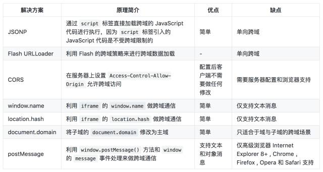
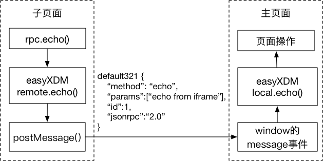
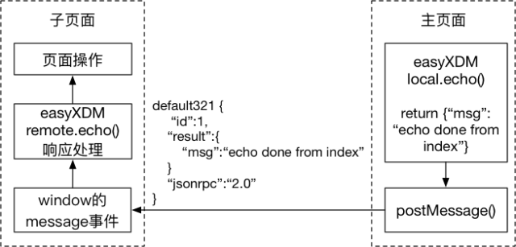

# 跨域

网站页面间发生数据请求和传输时，只要两个网址中的协议名 protocol、主机 host、端口号 port 三个中的任意一个不同，就构成了跨域。跨域的页面默认情况下不能通过 JavaScript 直接操作对方的页面对象。

## easyXDM

easyXDM 是一个较为成熟的js跨域解决方案，集成了现有的多种跨域解决方案，兼容性较好，在ie6,7中使用的是flash，其他浏览器使用的是：PostMessageTransport。

## easyXDM 原理
easyXDM 对不同的底层通信机制进行封装，比如上面实例中使用了 **postMessage** 机制来实现跨域双向通信。

### 子页面发送数据给主页面

easyXDM 将方法调用操作进行打包后通过 postMessage 发送给主页面，主页面的 message 处理函数收到数据后交由 easyXDM 进行解析后调起调用函数。代码调用和数据流如下图所示：

传递的数据说明：

* **defaultXXX**: 为通道标识符，页面不刷新的情况下，这个值不变
* **id**: 请求编号，自增，每发送一次请求加1
* **method**: 需要调用的方法名
* **params**: 调用方法的参数，以 JSON 格式表示
* **jsonrpc**: 表示 JSON-RPC 消息版本

### 主页面方法返回响应数据
easyXDM 同样会调用 postMessage 将方法响应发回给子页面，子页面的 message 处理函数收到数据后交由 easyXDM 进行解析，解析后执行对应的响应处理操作。代码调用和数据流如下图所示：

传递的数据说明：

* **defaultXXX**: 为通道标识符，页面不刷新的情况下，这个值不变；与子页面发送的数据一致
* **id**: 与调用方法时发送的 id 一致
* **result**: 方法响应，以 JSON 格式表示
* **jsonrpc**: 表示 JSON-RPC 消息版本

## 代码解析

### 主页面
主页面调用 **easyXDM.Rpc()** 的时候会初始化通信组件，同时会创建 iframe 子页面；具体参数含义介绍如下：

* **isHost**: true，表示创建 iframe 子页面
* **remote**: 创建的 iframe 子页面的 url
* **container**: 值为 DOM 对象，创建出来的 iframe 会被包含在 container 中
* **props**: 属性中指定的内容会被附加到 iframe 对象上
* **hash**: 为 true 代表通道相关的 xdm_e / xdm_c / xdm_p 参数会在网址 hash 中记录，为 false 时会变成 url 参数；一般情况下建议设为 true，因为把跨域相关的前端参数传递给后端并不是个很好的方式，但可以解决后面的表单提交后的通道保持问题；所以具体场景具体选择。

通过合理设置以上属性，就可以将原来写死在页面上的 iframe 改为通过 easyXDM.Rpc() 的方式进行加载，从而实现代码的灵活嵌入。

实例中父页面 Rpc 初始化后的网页元素如下：

<pre><code>

    <iframe 
        name="easyXDM_default5341_provider"
        id="easyXDM_default5341_provider"
        frameborder="0"
        scrolling="no"
        src="http://localhost:3001/iframe.html#xdm_e=http%3A%2F%2Flocalhost%3A3000&amp;xdm_c=default5341&amp;xdm_p=1" 
        style="width: 100%; height: 100px;">
    </iframe>

</pre></code>

其中 iframe 的 name 和 id 是自动生成的，作用是区分不同的 Rpc 通道，也就意味着在一个页面上可以建立多个跨域调用的通道。中间的 xdm_e / xdm_c / xdm_p 参数是初始化后的通道参数。

另外 local 参数配置定义了子页面可以调用的函数方法名和方法实现，方法名、方法参数等都可以任意按需指定。

